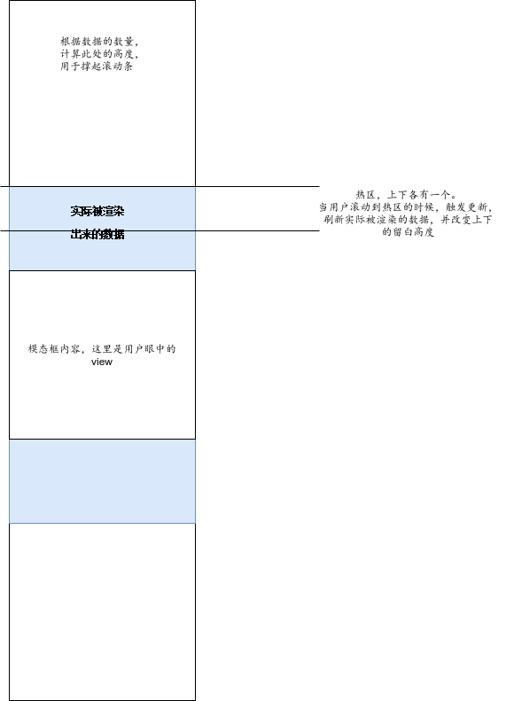

BOS3DUI 部分
========

# 写在前面

熟读需求文档才能理解业务逻辑，才能理解代码。

# 项目结构

```
src
├── index.jsx
├── Libs         
│   ├── annotation // 批注库
│   ├── LineEditor // 路线编辑器，目前用于帧编辑
│   ├── react // 自定义react，目前扩充了一个hook，需要的时候可以引用
│   └── THREE // 内部用到的THREE
└── UI // UI库
    ├── AnnotationUI // 批注UI
    ├── Base // 基础库UI模块，包含一些基本的UI抽象
    │   ├── Alert // 确认弹出框（有遮罩版本，会挂载到document.body上）
    │   ├── ColorBoard // 取色板
    │   ├── confirm.jsx // 确认弹出框（无遮罩，会挂载到viewportDiv上）
    │   ├── Icon.jsx // 图标类
    │   ├── icon.less
    │   ├── Modal.jsx // 模态框
    │   ├── modal.less
    │   ├── Toolbar.jsx // 工具条
    │   └── toolbar.less
    ├── theme // css主题包，包括默认样式和一些样式模板
    ├── Icon // 各个功能模块的实现
    │   ├── action.js
    │   ├── actionType.js
    │   ├── ChangeBgColor.jsx // 改变背景色
    │   ├── ChangeCptColor.jsx // 改变构件颜色
    │   ├── CptInfo // 查看构件属性
    │   ├── Fit.jsx // 聚焦
    │   ├── fuckIE.less // IE兼容性样式声明（针对postcss插件无法自动处理的情况）
    │   ├── Fullscreen.jsx // 全屏
    │   ├── Hide // 构件隐藏
    │   ├── img // 一些图标，包含两种主题
    │   │   ├── blue
    │   │   └── white
    │   ├── Init.jsx // 初始化模型
    │   ├── Isolate // 构件隔离
    │   ├── Mark // 标签
    │   ├── Measure // 测量
    │   ├── PickByRect // 框选
    │   ├── reducer.js
    │   ├── Roam // 漫游，包含两种漫游方式
    │   ├── Scatter // 模型分解
    │   ├── InfoTree // 包含系统树和空间树，理论上支持加载无限长树形列表
    │   ├── Section // 模型剖切，包含传统剖切和自由剖切
    │   ├── Snapshot // 快照
    │   ├── Undo // 撤销
    │   └── WireFrame.jsx // 线框化
    ├── index.jsx
    ├── reducer.js // 总的combineReducer在这里
    ├── store.js // 顶层store
    ├── generateListener.js // 用来生成与用户交互的函数，目前包含快照、标签、路网相关的方法
    ├── toastr // 用户提示用弹窗
    ├── Toolbar
    │   ├── ViewControlToolbar // 右上角的下拉菜单
    │   ├── Bottom.jsx
    │   ├── bottom.less
    │   ├── TopRight.jsx
    │   └── topRight.less
    ├── userRedux // 一些用来与开发者进行内外交互的redux
    ├── systemRedux // 系统redux，用来初始化一些不可变的系统变量
    └── utils // 几个小工具
```


# 通用规范

## UI初始化

初始化逻辑从入口开始，用户传入必要参数，内部传入`Viewer3DUI.jsx`，并在初始化后添加必要的事件函数，提示一些错误。右键菜单的响应也是在这里添加的。

## redux调试

安装`redux devtool`插件。本项目默认启用了它的配置，在浏览器中安装好插件后重启一下即可。

## 创建工具图标

`/src/UI/Toolbar` 下面有一些已经做好的工具条，可以直接在里面添加图标。也可以自己创建新的工具条。

如果新建工具条，可以直接用 `/src/UI/base/Toolbar` 来创建。

使用 `/src/UI/base/Icon` 可以方便地创建新的工具栏图标。

在 `/src/UI/index.jsx` 内部直接添加新的toolbar。

## 与三维交互

`/src/UI/systemRedux/reducer.js` 中存放了所有外部变量。需要调用外部变量（包括但不限于viewer3D, BIMWINNER）的时候，必须从此处获取，而不要直接 `window.xxx` 。

## 与用户交互

内外交互是通过`eventEmitter`实现（此实例也在`redux store`的`system`内保存），并进行状态隔离

如果需要交互的部分涉及到组件状态修改，可以通过 `/src/UI/userRedux` 来操作（或者创建自己的reducer，然后通过 `/src/UI/reducer.js` 合并进去）。

## 组件间状态交互

状态切换在 `/src/UI/Icon/reducer.js` 内处理。可以自由扩展现有的action。

自定义的 `reducer` 要通过 `/src/reducer.js` 合并。

### 模式切换

按钮之间的“开启xx模式时关闭xx模式”是靠redux store里button分类下的mode的值来控制的。当mode变化的时候，在需要切换的模块下添加自己的监听逻辑并处理。

### 鼠标图标切换

`/src/UI/MouseIcon/`负责监听鼠标图标切换的状态变化（也在button分类下），并进行响应，切换到对应的图标。

## 模块入口

所有模块的入口都要有默认的`index`

# 更加详细的文档

详见每个模块内部的`jsdoc`

# 模型树

位于`/src/UI/Icon/InfoTree`

## 基本思想

将 json 数据转换为 {}[]，这样可以方便渲染任何指定区间的数据。每条数据里都包含一些必要的信息，包括数据本身的信息、节点缩进、子代数量、节点路径等等。



## 代码架构

主要是分管理器和渲染器两部分

管理器的职责是：请求数据，管理各个树之前的切换，协调搜索框功能和树的搜索选中之间的联动。

渲染器的职责是：根据指定的树数据，渲染出模型树UI，并响应用户和模型的高亮、隐藏等事件。

## 文件结构

`index.jsx` 是入口，负责渲染出打开模型树的图标，并引入模型树模块。

`TreeManager.jsx`是管理器。

`Tree.jsx`是渲染器。

`IndeterminateIcon.jsx`和`CheckboxIcon`是半选中和（不）选中的图标

`Option`用来渲染不同树类别的选项卡

`FamilyProperty.jsx`用来渲染族属性

## 数据管理器

主要有2个任务：协调数据切换，协调UI布局及切换

初始化的时候，需要请求数据，并按一定格式存储（在构造函数里有注释说明）。注意其他树有依赖条件编译测试，在生产环境构建内不会包含测试代码。

初始化后直接调用`genTreeComponent`生成对应的UI渲染出树即可。

## 数据渲染器

数据渲染的核心思想在前面的图里。此模块开头有一些常量，标识了内部逻辑运算需要用到的值（包括上图具体的一些范围值）

初次渲染树，需要初始化树数据，将json格式转换为数组格式，方便直接渲染任意范围内的节点。具体的数据模型，在`transDataToRender`函数内部的注释有说明。之后，需要求每个根节点的位置，后续有递归处理树节点状态的逻辑，需要从树的根节点开始处理（注意根节点代表模型本身）。

初次渲染完毕之后，要注册一些事件监听（同样是对应了一些需求），具体的直接查看`componentDidMount`。

UI在渲染的时候，先计算（用户眼中）显示的节点数，算出当前需要的头尾留白的高度，用于撑开滚动条。然后在中间填入实际看到的节点。当滚动的时候，判断头尾的检测区域是否露出，如果露出则更新UI（逻辑在`onScroll`内）。

### transDataToRender

原始数据格式：

最小node单位必须是{}类型，其中包含name和构件key

树的节点或者是最小node数组，或者是 {中间节点名字: 树节点数组, 族的key（可选）} ，或者是树节点数组。

树的节点组成完整的树。

如果中间节点包含了族的key，那么所有子节点一定是族（有后端业务逻辑保证，前端不用判断）。

数据翻译算法：

说白了很简单，就是按照上述数据格式，从根节点开始递归访问并返回。由于树高很小，因此不会陷入递归爆栈的问题。
不过，为了方便操作，要加入一些额外的数据信息。key也叫节点id，就是节点出现的顺序（index），用于方便访问节点。route代表节点路径，通过节点路径可以方便地知道所有父节点的位置。children代表直接子代数，allChildren代表所有子代数，这2个值用于遍历子代。

### genTreeNode

这个函数比较简单，是用来将一条原始数据翻译成一个UI node节点。所有的树节点都靠它渲染出来。

### 元操作

渲染器内部包含一些元操作，它们构成最小操作函数，负责提供基础的操作支持。如 checkNode, expandNode, expandToShowNode, calStartIndex等等。可以先详细阅读模块内的函数签名，看注释和函数名称都可以理解。元操作直接改变渲染用数据，且由于数据量大，它们不在state内部。重新渲染需要手动setState或者forceUpdate。

注意在节点跳转的时候，跳转到第k个点的时候，它可能是隐藏的。有两个方案解决问题。1、展开指定节点的所有父代，这样它就是显示的，然后计算真实的startIndex，最后update；2、直接计算真实的startIndex，最后update。calStartIndex函数会计算真实的起始节点，它会保证跳过不显示的点，并且保证当前窗口总是有固定数量的数据，防止展示的数据量不足导致问题（除非显示的节点总数也不够用）

### 附加操作

除了元操作以外，其余的操作都是通过元操作的组合调用实现的。这其中也包含大量业务逻辑，需要看需求文档辅助理解。

遇到不理解的操作，多查看需求文档。

# 漫游

漫游分为自由漫游、路径漫游、漫游录制，它们的区别见需求文档。

## 目录结构

`index.jsx`是入口。由于历史原因，自由漫游和漫游切换的逻辑也在这个文件里。

`Instructions.jsx`是自由漫游左下角的操作提示。

`FreeRoamOption.jsx`是自由漫游模式下，工具栏上方的操作选项。

`RoamManager.js`用来管理漫游录像的一些操作，主要是用来管理多个路径对象直接的协调关系（比如多路径播放冲突等），以及UI漫游逻辑和Viewer录像生成器之间的协调工作。后文会介绍这点。

`fileParser`是用来做漫游录像数据和用户文件的转换（既导入导出录像）

`RouteRoam`是路径漫游功能

`RoamRecord`是漫游录制功能

## 漫游模式切换

`/src/UI/Icon/Roam/index.jsx`是入口，其中的 update 检测里有参数切换的逻辑。

## 路径漫游

此模块主要关注`RouteManager.jsx`，里面负责协调各个子模块的运转。

路径漫游面板主要分为视角管理、导入导出管理、路径管理三大块。

路径漫游需要与Viewer库的Roam和RoamPlayer模块进行交互，这两个模块的接口需要了解。viewer的Roam负责路线插值算法，能将给定的关键点按一定算法处理成平滑曲线，RoamPlayer模块负责播放漫游。

### 视角管理

视角管理负责一些视角编辑和帧编辑任务。需要注意的点有：

* `updateCircleList`函数负责更新视角正下方的投影点（如果那里有模型），需求是要求在用户的视角正下方有个点。
* 凡是改变了视角的位置信息（包括顺次），都需要回收帧编辑相关的缓存对象，防止出现问题。

每个视角项主要是渲染UI和响应事件，具体的逻辑都在视角管理器（父组件）内。

`FrameEditor`负责渲染帧编辑的UI和响应事件，核心逻辑（UI无关的）都在`/src/Libs/LineEditor`内，它负责与三维交互。具体文档查看其文件夹内的`README.md`

### 路径管理

路径管理主要是协调保存过的路径和其他功能之间的联动。要注意的点有：

* 导入路径的时候，要特别处理有帧编辑的情况，把里面的数据提取出来。
* 播放路径的时候，要注意不同路径同时播放的时候要处理冲突。roamManager里有处理冲突的逻辑，可以看文件内的注释说明。

